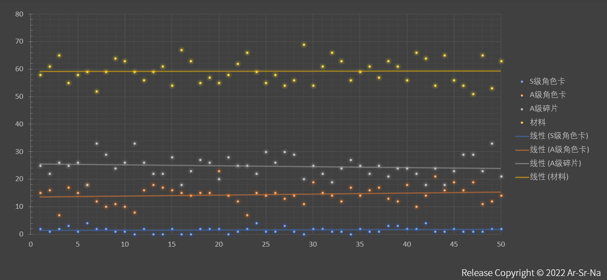

# ArSrNa False Random 伪随机算法

## 原理

使用JavaScript中 `Math.random()`方法，无加权地生成任意随机数，当且仅当这个数小于等于给定概率[0,1]时，执行下一步回调


````js
if(Math.random()<=0.5) callback()
//加权概率为0.5
````

示例：生成100个概率为0.5与一个概率为0.3的随机变量，并求出频率

````js
function num(){
var sA=0,sB=0;
 for(var i=0;i<100;i++){
    var rds=Math.random().toFixed(2);
    switch(true){
        case rds<=0.5:
            sA++
        break;
        case rds<=0.3:
            sB++
        break;
    }
  }
return(`A:${sA/100} B:${sB/100}`)
}
````


结果如下


## DEMO

### 浏览器

引入本模块

`<script src="index.js></script>`

### nodejs

直接复制全文粘贴至业务代码上

## 方法

### API

````js
specific(概率,保留小数位,友好名称,次数,保底参数{time:次数})
````

其中

| 参数       | 类型    | 备注                                    |
| ---------- | ------- | --------------------------------------- |
| 概率       | float   | 取值 [0,1]                              |
| 保留小数位 | float   | 概率保留小数位，即精度                  |
| 友好名称   | string  | 当前概率回调后返回的名称，示例：test:20 |
| 次数       | Integer | 生成随机数的次数                        |
| 保底参数   | Json    | 多少次必出，格式为 `{time:次数}`      |

### 内置方法DEMO

````js
var rname=['薪炎之律者角色卡','午夜苦艾角色卡','白夜执事角色卡','黯蔷薇角色卡','蓝莓特攻角色卡','午夜苦艾碎片','白夜执事碎片','黯蔷薇碎片','蓝莓特攻碎片','高级技能材料','相转移镜面','装甲残晶'],
    exp=[1.50,4.50,3.00,3.00,3.00,15.00,3.33,3.33,3.33,1.50,6.00,36.50],
    bd=[100,10,10,10,10,0,0,0,0,0,0,0,0,0,0,0,0,0,0,0,0,0]
    res=[];
    for(var i=0;i<exp.length;i++){
        console.log(specific(exp[i],2,rname[i],100,bd[i]));
    }
````

## 返回结果

如上述DEMO

````js
{ name: '薪炎之律者角色卡', times: 1, probable: 0.01 }
{ name: '午夜苦艾角色卡', times: 3, probable: 0.03 }
{ name: '白夜执事角色卡', times: 4, probable: 0.04 }
{ name: '黯蔷薇角色卡', times: 3, probable: 0.03 }
{ name: '蓝莓特攻角色卡', times: 4, probable: 0.04 }
{ name: '午夜苦艾碎片', times: 10, probable: 0.1 }
{ name: '白夜执事碎片', times: 0, probable: 0 }
{ name: '黯蔷薇碎片', times: 3, probable: 0.03 }
{ name: '蓝莓特攻碎片', times: 3, probable: 0.03 }
{ name: '高级技能材料', times: 0, probable: 0 }
{ name: '相转移镜面', times: 9, probable: 0.09 }
{ name: '装甲残晶', times: 40, probable: 0.4 }
````

| 字段     | 类型    | 解释     |
| -------- | ------- | -------- |
| name     | string  | 友好名称 |
| times    | Integer | 次数     |
| probable | float   | 出现概率 |


# 预期结果

````js
var result={
    S级角色卡:0,
    A级角色卡:0,
    A级碎片:0,
    材料:0,
}
 for(var i=0;i<100;i++){
    var rds=(Math.random()).toFixed(3);
    switch(true){
        case rds<0.015:
            result.S级角色卡++
        break;
        case rds>=0.015&&rds<0.15:
            result.A级角色卡++
        break;
        case rds>=0.15&&rds<0.4:
            result.A级碎片++
        break;
        case rds>=0.4&&rds<1:
            result.材料++
        break;
    }
  }
  return result
````




---

Powered by Ar-Sr-Na
www.arsrna.cn
