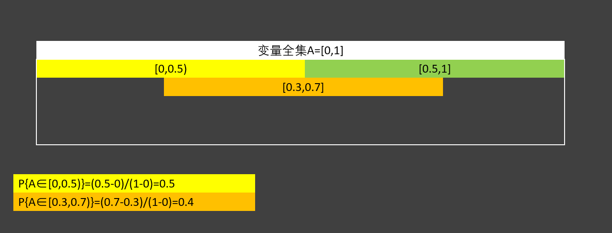
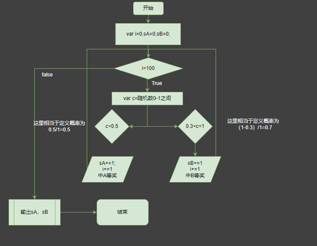
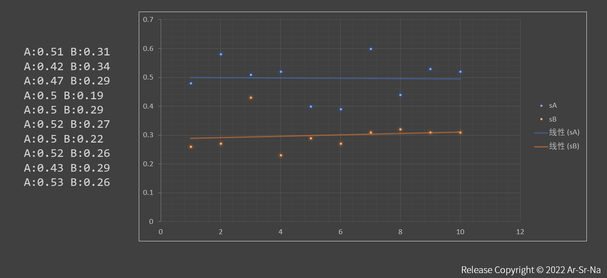
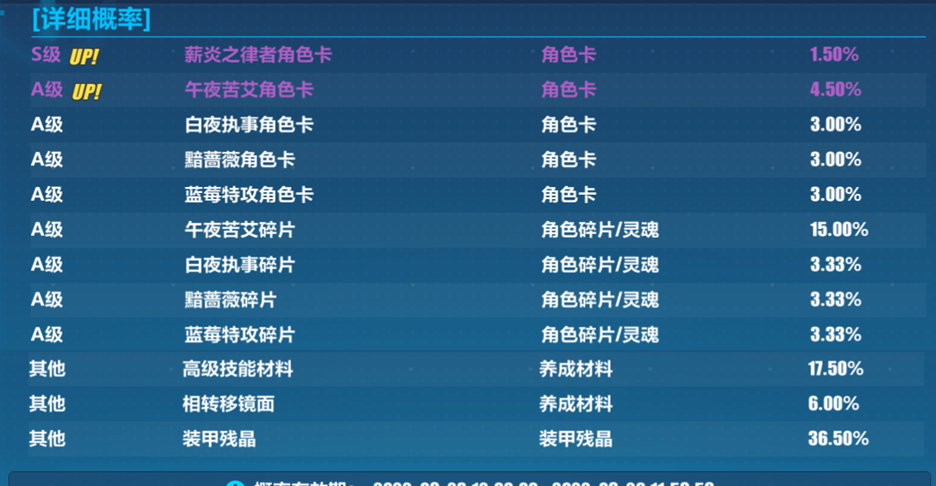
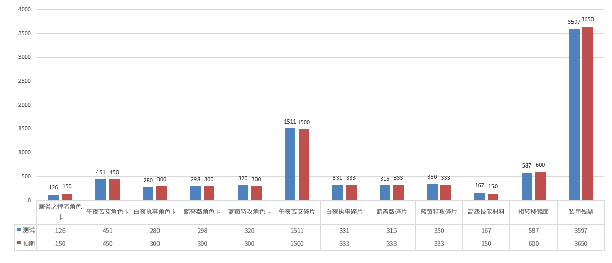

# ArSrNa False Random 伪随机算法

## 原理

使用JavaScript中 `Math.random()`方法，无加权地生成任意随机数，当且仅当这个数小于等于给定概率[0,1]时，执行下一步回调



````js
if(Math.random()<=0.5) callback()
//加权概率为0.5
````

示例：生成100个概率为0.5与一个概率为0.3的随机变量，并求出频率


````js
function num(){
var sA=0,sB=0;
 for(var i=0;i<100;i++){
    var rds=Math.random().toFixed(2);
    switch(true){
        case rds<=0.5:
            sA++
        break;
        case rds<=0.3:
            sB++
        break;
    }
  }
return(`A:${sA/100} B:${sB/100}`)
}
````

结果如下


## Usage

### 浏览器

引入本模块

`<script src="index.js></script>`

### nodejs

直接复制全文粘贴至业务代码上

### 方法

````js
specific(exp,name,times,bdArgs)
````

其中

| 参数   | 名称     | 类型    | 备注                                          |
| ------ | -------- | ------- | --------------------------------------------- |
| exp    | 概率     | float   | 取值 [0,1]                                    |
| name   | 友好名称 | string  | 当前概率回调后返回的名称，示例：test:20       |
| times  | 次数     | Integer | 生成随机数的次数                              |
| bdArgs | 保底参数 | Json    | ['times']:多少次必出，格式为 `{times:次数}` |

## 预期效果

### 内置方法DEMO

以崩坏3 2022-10-27 卡池为例



`demo.js` 中 `test()` 方法解释如下

````js
function test(){
    var rname=['薪炎之律者角色卡','午夜苦艾角色卡','白夜执事角色卡','黯蔷薇角色卡','蓝莓特攻角色卡','午夜苦艾碎片','白夜执事碎片','黯蔷薇碎片','蓝莓特攻碎片','高级技能材料','相转移镜面','装甲残晶'],
    exp=[1.50,4.50,3.00,3.00,3.00,15.00,3.33,3.33,3.33,1.50,6.00,36.50],
    bd=[100,10,10,10,10,0,0,0,0,0,0,0,0,0,0,0,0,0,0,0,0,0]
    res=[];
    for(var i=0;i<exp.length;i++){
        res.push(specific(exp[i],rname[i],10000,{times:bd[i]}))
    }
    console.log(res);
}
````

上述代码中

| 变量  | 参数解释                    | 示例参数                                                                                                                                                                                    |
| ----- | --------------------------- | ------------------------------------------------------------------------------------------------------------------------------------------------------------------------------------------- |
| rname | 各项返回友好名称            | `['薪炎之律者角色卡','午夜苦艾角色卡','白夜执事角色卡','黯蔷薇角色卡','蓝莓特攻角色卡','午夜苦艾碎片','白夜执事碎片','黯蔷薇碎片','蓝莓特攻碎片','高级技能材料','相转移镜面','装甲残晶']` |
| exp   | 各项概率                    | `[1.50,4.50,3.00,3.00,3.00,15.00,3.33,3.33,3.33,1.50,6.00,36.50]`                                                                                                                         |
| bd    | 各项保底次数（几次必出1次） |`[100,10,10,10,10,0,0,0,0,0,0,0,0,0,0,0,0,0,0,0,0,0]`|
| res   | 缓存数组                    |`[]`|

通过for遍历整个数组，一项项试验返回结果，再把结果压入缓存，最后输出


| 字段     | 类型    | 解释     |
| -------- | ------- | -------- |
| name     | string  | 友好名称 |
| times    | Integer | 出现次数 |
| probable | float   | 出现频率 |

### 预期结果
````js
[
  { name: '薪炎之律者角色卡', times: 126, probable: 0.0126 },
  { name: '午夜苦艾角色卡', times: 451, probable: 0.0451 },
  { name: '白夜执事角色卡', times: 280, probable: 0.028 },
  { name: '黯蔷薇角色卡', times: 298, probable: 0.0298 },
  { name: '蓝莓特攻角色卡', times: 320, probable: 0.032 },
  { name: '午夜苦艾碎片', times: 1511, probable: 0.1511 },
  { name: '白夜执事碎片', times: 331, probable: 0.0331 },
  { name: '黯蔷薇碎片', times: 315, probable: 0.0315 },
  { name: '蓝莓特攻碎片', times: 350, probable: 0.035 },
  { name: '高级技能材料', times: 167, probable: 0.0167 },
  { name: '相转移镜面', times: 587, probable: 0.0587 },
  { name: '装甲残晶', times: 3597, probable: 0.3597 }
]
````
与预期数据比较



数据基本拟合

---

Powered by Ar-Sr-Na
www.arsrna.cn
